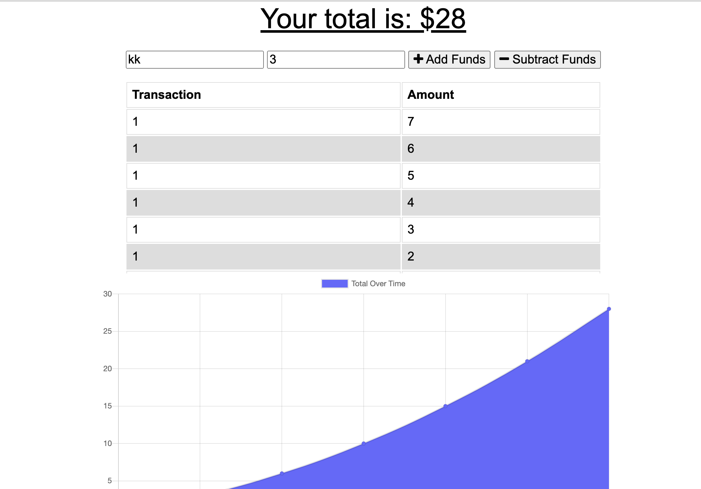

# OnlineOfflineBudgetTrackerHW18

## Table of Contents: 
[Project Description](#Project-Description)  
[Usage Information](#Usage-Information)   
[Questions and Contact Information](#Questions-and-Contact-Information)  
[Screenshots](#Screenshots)  
[Heroku](#Heroku)  

## Project Description 
This app allows users to track their budget offline and online. The app is deployed through Heroku and Data is stored in Mongo DB. The data is stored in local storage while offline and then transferred to storage in Mongo DB when the user comes online again.

## Usage Information 
Please visit https://offlineonlinebudgettracker.herokuapp.com/ to run the application. 

### Questions and Contact Information 
Github: github.com/Alexgoldman98  
Github username: Alexgoldman98   
Email address: alexgoldman98@gmail.com  
Any Questions should be directed to me using the above contact information.

### Screenshots

### Application Link
https://offlineonlinebudgettracker.herokuapp.com/